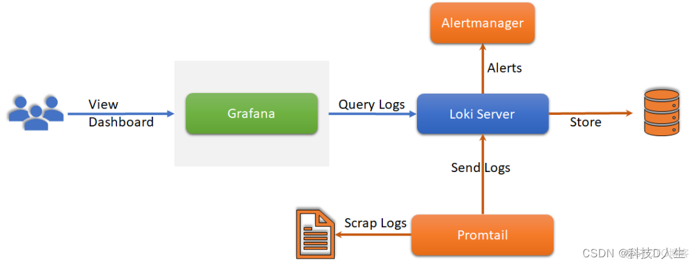
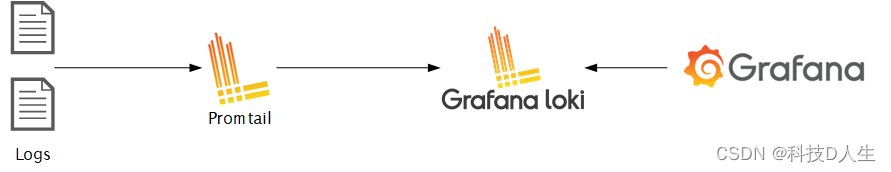

# 1 #

Loki 作为日志系统的后起之秀，设计上可以说非常优秀，设计的理念就是为了让日志聚合更简单，它被设计为非常经济高效且易于操作。它不索引日志的内容，而是为每个日志流设置一组标签。它主要由三部分组成：

> - Promtail 是日志收集器，负责收集应用的日志并发送给 Loki。
> - Loki 用于日志的存储和解析，并提供查询 API 给下游展示。
> - Grafana 负责将 Loki 的日志可视化。

# 2 

Loki 的架构如下：

不难看出，Loki 的架构非常简单，主要由以下 3 个部分组成：

- Loki 是主服务器，负责存储日志和处理查询。
    
- Promtail是代理，负责收集日志并将其发送给 Loki 。
    
- Grafana 用于 UI 展示。
    

Loki 使用了和 Prometheus 一样的标签来作为索引。也就是说，你通过这些标签既可以查询日志的内容也可以查询到监控的数据，不但减少了两种查询之间的切换成本，也极大地降低了日志索引的存储。

Loki 使用与 Prometheus 相同的服务发现和标签重新标记库，编写了 Pormtail。在 Kubernetes 中 Promtail 以 DaemonSet 方式运行在每个节点中，通过 Kubernetes API 得到日志的正确元数据，并将它们发送到 Loki。
