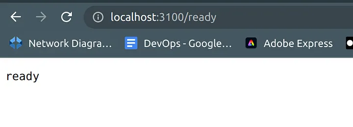

# 1 通过Docker安装 

https://ghazanfaralidevops.medium.com/grafana-loki-promtail-complete-end-to-end-project-d698aaa636d6


localhost:3100/ready



# 2 通过helm安装

https://github.com/grafana/loki/blob/main/production/helm/loki/values.yaml

我仔细研究过， 通过helm 安装loki 在 kubnetes cluster中。 没办法 expose loki through ingress of cluster 
只能 通过 ingress to expose loki 的 push api 

==== Customize client config options

By default, promtail send logs scraped to `loki` server at `http://loki-gateway/loki/api/v1/push`. If you want to customize clients or add additional options to `loki`, please use the `clients` section. For example, to enable HTTP basic auth and include OrgID header, you can use:

```yaml
config:
  clients:
    - url: http://loki.server/loki/api/v1/push
      tenant_id: 1
      basic_auth:
        username: loki
        password: secret
```
