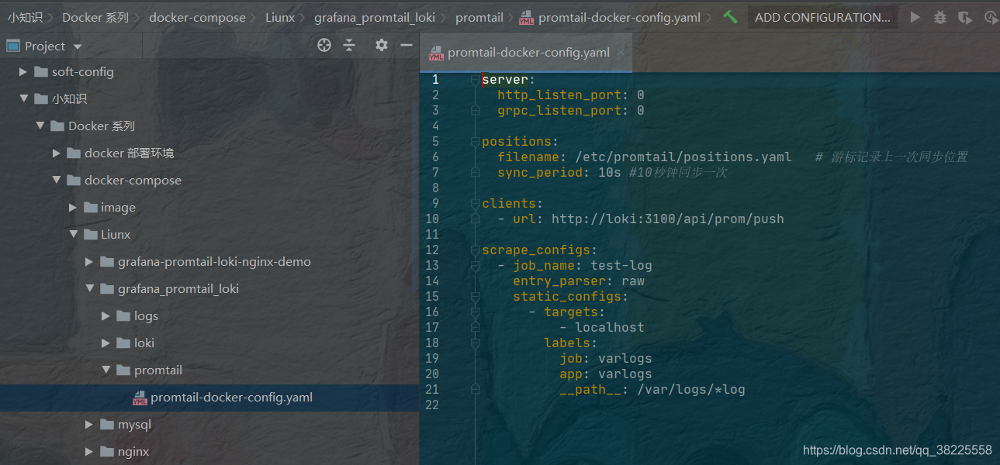

https://blog.csdn.net/qq_38225558/article/details/107524340

# 1 启动 Loki 容器

```
cd /apps/loki
docker-compose up -d
```

```
wget https://raw.githubusercontent.com/grafana/loki/v2.0.0/production/docker-compose.yaml -O docker-compose.yaml
docker-compose -f docker-compose.yaml up -d

[root@localhost loki]# docker-compose ps
     Name                    Command               State           Ports
---------------------------------------------------------------------------------
loki_grafana_1    /run.sh                          Up      0.0.0.0:3000->3000/tcp
loki_loki_1       /usr/bin/loki -config.file ...   Up      0.0.0.0:3100->3100/tcp
loki_promtail_1   /usr/bin/promtail -config. ...   Up
```

# 2 检查 Loki 容器状态、查看 Loki 容器日志

```
cd /apps/loki
docker-compose ps
docker-compose logs -f
```


# 3 在grafana中配置loki

配置完毕后执行 `docker-compose -f <docker-compose.yml 路径> up` 命令，会先下载镜像然后启动三个 Docker 容器。成功后打开 `http://localhost:3000/` 登录 Grafana，默认账号密码是 `admin/admin`。

运行成功后登录Grafana，账号密码为admin:admin，登录成功后需要添加Loki为数据源，访问地址：http://192.168.7.149:3000/


## 3.1 预先配置

1 侧边栏添加数据源为 Loki 
ttp://192.168.7.149:3000/

访问地址：http://127.0.0.1:3000
默认登录账号密码：admin/admin


[](https://raw.githubusercontent.com/wsgzao/storage-public/master/img/20201030174015.png)


在数据源选择界面中直接选择Loki，我们可以看到Grafana也支持使用Elasticsearch作为数据源；


----

2 在数据源列表中选择Loki，配置 Loki 源地址：

[](https://raw.githubusercontent.com/wsgzao/storage-public/master/img/20201030174058.png)


 然后配置 Loki 的 URL 为 `http://loki:3100`，然后点确定和测试，有绿色提示就表示成功了。


源地址配置http://loki:3100即可，保存。

----

3 保存完成后，切换到 grafana 左侧区域的Explore，即可进入到Loki的页面：

[](https://raw.githubusercontent.com/wsgzao/storage-public/master/img/20201030174206.png)


 我们使用的是 **Docker Compose**，因此 `hostname` 是服务名称 `loki`。然后点击侧边栏一个指南针形状的图标 **Explore**，就进入日志的 UI 了，这时候啥也没有。


---


 然后点击 Log labels 就可以把当前系统采集的日志标签给显示出来，可以根据这些标签进行日志的过滤查询


[](https://raw.githubusercontent.com/wsgzao/storage-public/master/img/20201030175253.png)


## 3.2 查看不同日志

1 
比如我们这里选择/var/log/messages，就会把该文件下面的日志过滤展示出来，不过由于时区的问题，可能还需要设置下时间才可以看到数据：

[](https://raw.githubusercontent.com/wsgzao/storage-public/master/img/20201030175134.png)

2 这里选择以文件名的方式查看日志信息  
  


3 根据日志级别筛选日志  
  


4 实时查看日志信息  


# 4 例子 查看 spring的日志

 得造点日志，搞一个 Spring Boot 应用，然后在 application.yml 中配置日志选项，然后启动应用生成一些日志。
```
spring:
  application:
    name: mall-tiny-loki

logging:
  path: /var/logs
  level:
    com.macro.mall.tiny: debug
```

使用如下命令运行SpringBoot应用，并把日志目录挂载到宿主机上，这样Promtail就可以收集到日志了；
```
docker run -p 8088:8088 --name mall-tiny-loki \
-v /etc/localtime:/etc/localtime \
-v /mydata/app/mall-tiny-loki/logs:/var/logs \
-e TZ="Asia/Shanghai" \
-d mall-tiny/mall-tiny-loki:1.0-SNAPSHOT
```


之后设置下你的Loki访问地址，点击`Save&test`保存并测试，显示绿色提示信息表示设置成功，Loki访问地址：http://192.168.7.149:3100


接下来在`Explore`选择Loki，并输入查询表达式（Loki query）为`{filename="/var/log/spring.log"}`，就可以查看我们的SpringBoot应用输出的日志了。


然后我输入了一个从文档中找到的查询日志的表达式（Loki query）{filename="/var/log/spring.log"}, 文件名称去 c:/docker/log 下看是否有日志。
Loki 中查询展示 Spring Boot 日志


# 5 运行一个java小程序测试日志


新建docker-compose.yml
温馨小提示：

- 这是个定时打印日志任务的java小程序；
- 该文件需与上面安装loki的docker-compose-grafana-promtail-loki.yml文件在同一级，目的：同步java程序的日志到promtail日志采集端，当然这里也可以通过将promtail放到容器中去采集日志，可参考：https://gitee.com/zhengqingya/docker-compose/tree/master/Liunx/grafana-promtail-loki-nginx-demo



```
version: '3'
services:
  log-java-demo:
    image: registry.cn-hangzhou.aliyuncs.com/zhengqing/log-java-demo:latest
    container_name: log-java-demo 
    volumes: 
      - ./grafana_promtail_loki/logs:/var/log
    ports:
      - "88:88"
```

运行程序
docker-compose up -d
