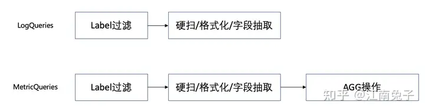

https://isitobservable.io/observability/kubernetes/how-to-observe-your-nginx-controller-with-loki





LogQL is composed of a {Stream selector} and a log pipeline where each step of your pipeline is separated by a vertical bar - |.


# 1 LogStreamSelector(label filter)

When collecting logs, our log agent collector adds context to our log stream like the pod name, the service name, etc. So the log stream selector allows us to filter our logs based on the labels available in our log stream.

对于查询表达式的标签部分，将其包装在花括号中`{}`，然后使用键值对的语法来选择标签，多个标签表达式用逗号分隔，比如：

```
{app="mysql",name="mysql-backup"}
```

目前支持以下标签匹配运算符：

- `=`等于
- `!=`不相等
- `=~`正则表达式匹配
- `!~`不匹配正则表达式

- = exactly equal
- != not equal
- =~ regexp matches
- !~ regexp does not match

比如：
```
{name=~"mysql.+"}
{name!~"mysql.+"}
```

```
{app=”mysql”,name=~”mysql-backup.+”}

=: exactly equal.
!=: not equal.
=~: regex matches.
!~: regex does not match.

```

适用于`Prometheus`标签选择器规则同样也适用于`Loki`日志流选择器。


# 2 The log pipeline 

The log pipeline helps you process and filter the logs stream with the help of label matching operators. It can be composed of:

- Line filter
- Parser
- Label filter
- Line format
- Labels format    
- Unwrap ( for metrics)
    

Let’s see them one by one

对内容进行删选 

## 2.1 Line filter

编写日志流选择器后，您可以通过编写搜索表达式来进一步过滤结果。搜索表达式可以只是文本或正则表达式。

对于查询表达式的标签部分，将其包装在花括号中 {}，然后使用键值对的语法来选择标签，多个标签表达式用逗号分隔，比如：
```
{instance=~"kafka-[23]",name="kafka"} != "kafka.server:type=ReplicaManager"
```

The line filter is similar to a grep applied over the aggregated logs. It will search the content of the log line. Here are the operators:

- |=: Log line contains string
    
- !=: Log line does not contain string
    
- |~: Log line contains a match to the regular expression
    
- !~: Log line does not contain a match to the regular expression


> |=：日志行包含字符串  
> !=：日志行不包含字符串  
> |~：日志行匹配正则表达式  
> !~：日志行与正则表达式不匹配

```
1 # 精确匹配：|="2020-11-16 "
2 {app_kubernetes_io_instance="admin-service-test2-container-provider"}|="2020-11-16 "

1 # 模糊匹配：|~"2020-11-16 "
2 {app_kubernetes_io_instance="admin-service-test2-container-provider"}|~"2020-11-16 "

1 # 排除过滤：!=/!~ "数据中心"
2 {app_kubernetes_io_instance="admin-service-master-container-provider"}!="数据中心"
3 {app_kubernetes_io_instance="admin-service-master-container-provider"}!~"数据中心"

1 # 正则匹配： |~ "()"
2 {app_kubernetes_io_instance="admin-service-master-container-provider"}!~"(admin|web)"
3 {app_kubernetes_io_instance="admin-service-master-container-provider"}|~"ERROR|error"

{job="mysql"} |= "error"
{name="kafka"} |~ "tsdb-ops.*io:2003"
{instance=~"kafka-[23]",name="kafka"} != kafka.server:type=ReplicaManager

过滤器运算符可以被链接，并将顺序过滤表达式-结果日志行将满足每个过滤器。例如：
{job="mysql"} |= "error" != "timeout"
```


举例，我需要查询包含关键字packages

```
{job="varlogs"}  |= "packages"
```

效果如下：

[](https://raw.githubusercontent.com/wsgzao/storage-public/master/img/20201103160550.png)

## 2.2 Parser expression

The parser expression can parse our log stream and extract labels from the log content using different functions:
- JSON
- Logfmt
- Parser
- Unpack
- Regexpp

Building upon the previous example:

            `{container=”frontend”} |= “error” | JSON`
        

The log stream is in JSON format:

            `{ “pod.name”= { “id:”deded”},  namespace:”test” }`
        

If I apply the JSON parser, as a result of that all those JSON attributes will be exposed as new labels in our transformed log stream, which will look like this:
- pod_name_id = “deded”
- namespace=test

You can also specify a parameter to JSON to specify which labels you would like to extract to avoid getting everything.

Logfmt will extract all keys and values from the logfmt format line.
```
at=info method=GET path=/
 host=mutelight.org
 fwd=”123.443.21.212”
 status=200 bytes=1653
```

Will turn into
- At = “info”
- method = GET
- path = /
- host = mutelight.org


## 2.3 Pattern parser

The pattern is a powerful parser tool that allows you to explicitly extract fields from the log lines.

For example, we have this log stream:
`192.176.12.1[10/Jun/2021:09:14:29 +0000] "GET /api/plugins/versioncheck HTTP/1.1" 200 2 "-" "Go-http-client/2.0" "13.76.247.102, 34.120.177.193" "TLSv1.2" "US" ""
`

This log line can be parsed with the following expression:
```
<ip> - - <_> "<method> <uri> <_>" <status> <size> <_> "<agent>" <_>
```
Using `<_>` shows that you're not interested in keeping a specific label.

## 2.4 Regexp parser

Regexp is similar to the pattern, but you can specify the expected format utilizing your regexp regular expression.

## 2.5 Label filter

Once you have parsed your log stream and extracted and added new labels, you will be able to apply new label filtering.

After my previous expression:
{container=”frontend”} |= “error” | JSON


I can add:
```
{container=”frontend”} 
|= “error” 
| JSON
| duration > 1m and 
bytes_consumed > 20MB
```

That shows that I’m interested in a specific duration and amount of bytes consumed. 

## 2.6 Line Format Expression

The line format expression helps you rewrite your log content by displaying only a few labels:

```
{container="frontend"}
| logfmt 
| line_format "{{.ip}} 
{{.status}} 
{{div .duration 1000}}"
```

## 2.7 Labels Format Expression

The label format can rename, modify and even add labels to our modified log stream. Then we can use Metric Queries to extract log streams and metrics from our log.

# 3 Metric Queries

Metrics queries apply a function to log query results and return a range vector.

There are two types of aggregators:
    Log range aggregation
    Unwrapped range aggregation


这个其实就跟prometheus中的很想像了.

## 3.1 不同之处 

The two types of aggregators, "Log Range Aggregation" and "Unwrapped Range Aggregation," likely refer to different methods of aggregating data over a specified range. Here's an explanation of their differences:

### 3.1.1 **Log Range Aggregation**
- **Purpose**: This type of aggregation is used to handle data that spans multiple orders of magnitude, which is common in scenarios where the data values can vary greatly (e.g., from 1 to 1,000,000).
- **Scale**: The aggregation bins are spaced logarithmically, meaning each bin covers a range that increases exponentially. For example, bins might cover ranges like 1-10, 10-100, 100-1000, etc.
- **Use Case**: Useful for visualizing or analyzing data that follows a power-law distribution or when it's important to capture variations across different scales. It helps in reducing the skew in the data distribution by compressing large ranges into manageable segments.

### 3.1.2 **Unwrapped Range Aggregation**
- **Purpose**: This aggregation type treats the data range linearly without any transformation or compression.
- **Scale**: The bins are spaced evenly across the entire range of data values. For example, if you're aggregating over a range from 0 to 100, each bin might cover an equal range, such as 0-10, 10-20, and so on.
- **Use Case**: Useful when you want a straightforward, linear aggregation where each segment of the range is treated equally. This is ideal for data that does not span multiple orders of magnitude and is relatively uniform in its distribution.

### 3.1.3 **Key Differences**
- **Aggregation Method**: Log range aggregation uses a logarithmic scale for binning data, while unwrapped range aggregation uses a linear scale.     unwrapped range aggregation 是线性处理的 
- **Applicability**: Log range is better for data with wide variations, while unwrapped range is more suitable for data with a consistent distribution.
- **Bin Distribution**: In log range aggregation, bins increase in size as the range increases, whereas in unwrapped range aggregation, all bins are of equal size.

These concepts are typically applied in data analysis, monitoring, and visualization tools where it's important to represent data in a way that makes patterns and trends more understandable, regardless of the scale of the data.

## 3.2 Log range aggregation

Similarly to Prometheus, a range aggregation is a query followed by a duration. Here are some of the supported functions:
- **rate(log-range):** calculates the number of entries per second
- **count_over_time(log-range):** counts the entries for each log stream within the given range.
- **bytes_rate(log-range):** calculates the number of bytes per second for each stream.
- **bytes_over_time(log-range):** counts the amount of bytes used by each log stream for a given range.
- **absent_over_time(log-range):** returns an empty vector if the range vector passed to it has any elements and a 1-element vector with the value 1 if the range vector passed to it has no elements. (absent_over_time is useful for alerting when no time series and logs stream exist for label combination for a certain amount of time.)
- `rate`: calculates the number of entries per second
- `count_over_time`: counts the entries for each log stream within the given range.
- `bytes_rate`: calculates the number of bytes per second for each stream.
- `bytes_over_time`: counts the amount of bytes used by each log stream for a given range.


### 3.2.1 rate：计算每秒的条目数

```
rate({job="mysql"} |= "error" != "timeout" [5m])
```


```
4 # 12h小时内出现错误的速率
5 rate({app_kubernetes_io_instance=~".*master-container.*"} |~ "ERROR|error" [12h])

rate(({job="mysql"} |= "error" != "timeout")[10s])
This query gets the per-second rate of all non-timeout errors within the last ten seconds for the MySQL job.
```


### 3.2.2 范围查询_count_over_time


count_over_time：计算给定范围内每个日志流的条目

```
# 三十分钟日志行记录
count_over_time({app_kubernetes_io_instance="admin-service-master-container-web"}[30m]) 


count_over_time({job="mysql"}[5m])
This query counts all the log lines within the last five minutes for the MySQL job.
```


### 3.2.3 例子 

In this example, we're defining a split by the host and only interested in the jobs related to MySQL, errors but not timeouts. We parse it to add new labels using JSON, and lastly, we're doing label filtering where we're only looking at durations above 10 seconds. 
```
sum by (host) (
rate(
 {job="mysql"} 
 |= "error" != "timeout" 
 | JSON 
 | duration > 10s 
[1m])
)
```

## 3.3 Unwrap range aggregations

Unwrap will specify which labels will be used to expose the metrics. Here are some of the supported functions for operating over unwrapped ranges:

- **rate(unwrapped-range):** calculates per second rate of all values in the specified interval.
- **sum_over_time(unwrapped-range):** the sum of all values in the specified interval.
- **avg_over_time(unwrapped-range):** the average value of all points in the specified interval.
- **max_over_time(unwrapped-range):** the maximum value of all points in the specified interval.
- **min_over_time(unwrapped-range):** the minimum value of all points in the specified interval
- **first_over_time(unwrapped-range):** the first value of all points in the specified interval
- **last_over_time(unwrapped-range):** the last value of all points in the specified interval
- **stdvar_over_time(unwrapped-range):** the population standard variance of the values in the specified interval.
- **stddev_over_time(unwrapped-range):** the population standard deviation of the values in the specified interval.
- **quantile_over_time(scalar,unwrapped-range):** the φ-quantile (0 ≤ φ ≤ 1) of the values in the specified interval.
- **absent_over_time(unwrapped-range)**
    

Example
```
quantile_over_time(0.99,
 {cluster="ops-tools1",container="ingress-nginx"}
 | JSON
 | __error__ = ""
 | unwrap request_time [1m])) by (path)
```

In this example, we want the percentile of 99. We're filtering only on the specific label of ops-tools1, and we also add another filter for the container. Then we parse it with JSON and use __error__ to remove potential errors. Lastly, we unwrap request_time above 1m.


# 4 Aggrestion运算

与vPromQL 一样，LogQL 支持内置聚合运算符的一个子集，可用于聚合单个向量的元素，从而产生具有更少元素但具有集合值的新向量：

```
sum：计算标签上的总和
min：选择最少的标签
max：选择标签上方的最大值
avg：计算标签上的平均值
stddev：计算标签上的总体标准差
stdvar：计算标签上的总体标准方差
count：计算向量中元素的数量
bottomk：通过样本值选择最小的k个元素
topk：通过样本值选择最大的k个元素


sum: Calculate sum over labels
min: Select minimum over labels
max: Select maximum over labels
avg: Calculate the average over labels
stddev: Calculate the population standard deviation over labels
stdvar: Calculate the population standard variance over labels
count: Count number of elements in the vector
bottomk: Select smallest k elements by sample value
topk: Select largest k elements by sample value


```


```
# 统计1个小时日志量最大的前10个服务 
topk(10,sum(rate({app_kubernetes_io_instance=~".*master-container.*"}[60m])) by(container))
 
# 统计最近6小时内错误日志计数
sum(count_over_time({app_kubernetes_io_instance=~".*master-container.*"}|~"ERROR"[6h])) by (container)

sum(count_over_time({job="mysql"}[5m])) by (level)
Get the count of logs during the last five minutes, grouping by level.

avg(rate(({job="nginx"} |= "GET")[10s])) by (region)
```


